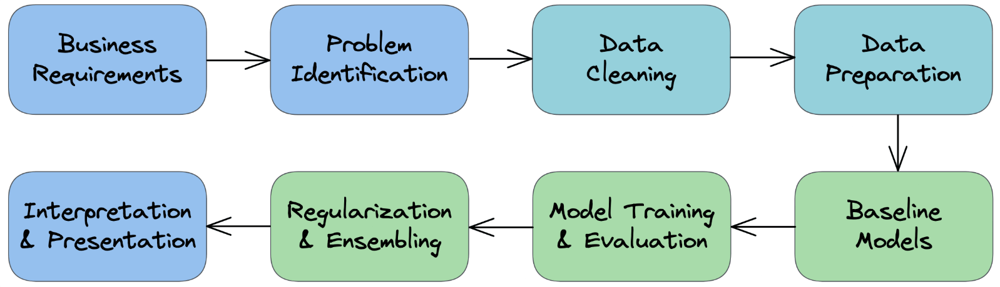

# Machine Learning Task Checklist

A concise checklist I use to run end-to-end ML projects.

- Overview diagram

	

- Understand the business requirements and the nature of the available data
- Classify the problem: supervised vs unsupervised; regression vs classification
- Download, clean, and explore the data; engineer features that may improve models
- Create training/validation/test splits and prepare data for modeling
- Build a quick baseline model to evaluate and benchmark future models
- Choose a modeling strategy, train the model, and tune hyperparameters
- Experiment and, if helpful, combine multiple strategies (ensembles)
- Interpret models, analyze errors/individual predictions, and present findings

> Tip: Keep notes on assumptions, decisions, metrics, and results for each step so you can reproduce and explain your work later.
